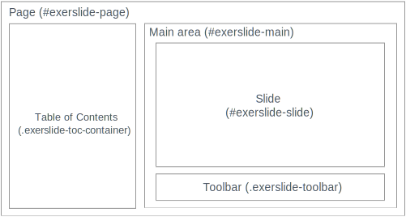

Before we can talk about customization in more detail, lets have a closer look
at the structure of the HTML document that exerslide produces:

<figure class="center">
  
  <figcaption>Wireframe of the HTML document structure</figcaption>
</figure>

The overall structure of the HTML document is defined by the **master layout**.

The default master layout tries to provide a simple document structure
whose appearance can be easily adjusted with CSS. Most IDs and classes that 
exerslide uses start with `exerlside-`. The most important ones are:
regions:

- `#exerlide-page`: The "root" area is called **page**. It covers the
  whole visible space and is divided into two subareas: **table of contents**
  and **main**.

- `.exerslide-toc-container`: The **table of contents** area contains links to 
  all slides. By default it covers the left side of the visible space.

- `#exerslide-main`: The **main** area covers the remaining visible space on 
  the right.  It contains the sub areas **slide** and **toolbar**.

- `.exerslide-toolbar`: The **toolbar** area is located at the
  bottom of the main area (bottom of the screen, not content) and contains
  buttons to go the next or previous slide.

- `#exerslide-slide`: Finally, the **slide** area contains the actual content.
  It covers the remaining available horizontal and vertical space on the page 
  and shows scrollbars if the content does not fit.

Again, this it the *default* master layout. The actual position of the
different areas can be customized using CSS, or you can modify the master
layout (`js/MasterLayout.js`) to add, remove or provide totally different areas 
/ structure.

## Custom CSS per slide

The simplest way to customize the look of a slide is to include custom CSS
rules in the meta data section of a slide. The `style` option lets you define 
CSS that is inserted when the slide is shown.

For example, to change the text color of whole slide to red:

::: a11y
```yaml
---
title: example
style: |
  #exerslide-slide {
    background-color: black;
    color: red;
  }
---
```

```yaml
---
{
  title: example,
  style: "
    #exerslide-slide {
      background-color: black;
      color: red;
    }"
}
---
```
:::

## Share custom CSS per slide

If you want multiple (but not all) slides to look similar, you can define a
list of CSS class names in the meta-data section and define rules for them in
your own stylesheet.

The default master layout adds the class names to the `#exerslide-page` element 
so that you can customize the whole page.

Example meta-data section:

::: a11y
```yaml
---
title: "Example title"
classNames: [importantSlide]
---
```

```yaml
---
{
  title: "Example title",
  classNames: [importantSlide]
}
---
```
:::

This would result in the following HTML:

```html
<div id="exerslide-page" class="importantSlide">
...
</div>
```

Don't forget to add your custom stylesheet to the [configuration 
file](#/exerslide.config.js).

## Override default styles

Adding a custom stylesheet would also be the way to override any predefined 
styles by exerslide.
